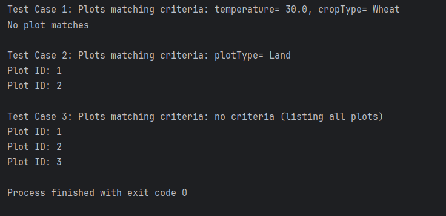

# TAISP-Grp-4-OODP

Sher - FarmManager()

FarmManger contains a list of plots <plotList> and has a function findPlot(). Which returns the matching plots based on user search criteras. Included a basic TestManger() to simulate received user inputs from CLIMenu as parameters for findPlot(). 

Also this is for TIM, my findPlot() relies on plot manager having a getPlot() function. so i can access the plot conditions and compare against the search criteras. 

